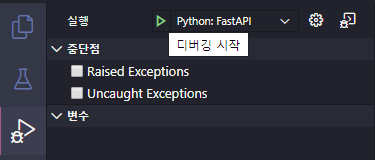
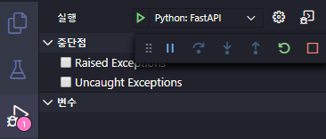
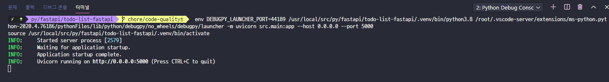
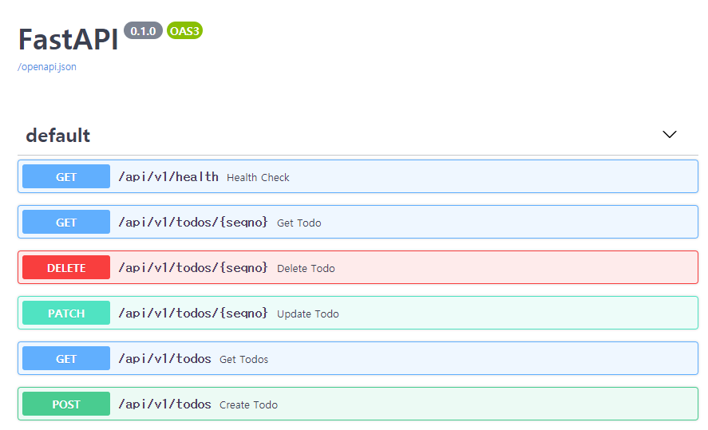
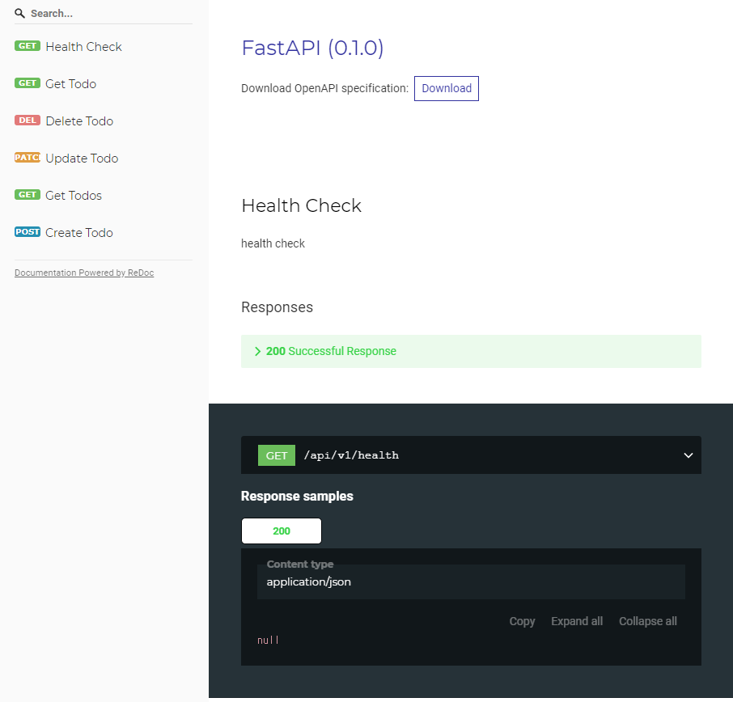

# todo-list-fastapi

practice project

## How to run

### Install dependencies

**npm, yarn:** standard-version, husky

**make:** script for lint, test

**pipenv:** virtualenv + pip

**python3.8:** asyncio

**docker, docker-compose:** infrastructure

```bash
sudo PIPENV_VENV_IN_PROJECT=true pipenv install --dev # ${PWD}/.venv
npm install yarn && yarn install --dev # ${PWD}/node_modules
```

### Run

#### 터미널에서 실행하기

```bash
$ pipenv run uvicorn src.main:app --host 0.0.0.0 --port 5000
Loading .env environment variables…
INFO:     Started server process [1539]
INFO:     Waiting for application startup.
INFO:     Application startup complete.
INFO:     Uvicorn running on http://0.0.0.0:5000 (Press CTRL+C to quit)
```

#### vscode에서 실행하기

```json
// .vscode/launch.json
{
    "version": "0.2.0",
    "configurations": [
        {
            "name": "Python: FastAPI",
            "type": "python",
            "request": "launch",
            "module": "uvicorn",
            "args": [
                "src.main:app",
                "--host",
                "0.0.0.0",
                "--port",
                "5000"
            ],
            "console": "integratedTerminal",
            "subProcess": true
        }
    ]
}
```

`.vscode/launch.json` 작성 후 `ctrl+shift+d`  -> 초록색 세모 버튼 클릭



디버그 컨트롤러



콘솔 확인


#### Docker

https://hub.docker.com/repository/docker/mcauto/todo-list-fastapi

```bash
$ docker pull mcauto/todo-list-fastapi:latest

$ docker run --rm -d --name todo-list-fastapi -p 5000:5000 --env USER_REPOSITORY_PATH=/code/data/users.json --env CORS_ALLOWS="[\"http://127.0.0.1\"]" mcauto/todo-list-fastapi:latest
c690c36b61dfca71253d3586ab285e3001826e6c0e2c3467f59cbfed0430b37a

$ docker ps -a
CONTAINER ID        IMAGE               COMMAND                  CREATED             STATUS              PORTS                    NAMES
c690c36b61df        todo-list-fastapi   "python -m uvicorn s…"   2 seconds ago       Up 1 second         0.0.0.0:5000->5000/tcp   todo-list-fastapi
```

#### 실행 화면



swagger: http://localhost:5000/docs



redoc: http://localhost:5000/redoc




### Code quality

#### Lint

```bash
make lint

pip 설치되어 있음 

pipenv 설치되어 있음 

Already installation 

[pycodestyle 시작] 
pipenv run pycodestyle --first ./src/routes/todos.py ./src/routes/health.py ./src/routes/__init__.py ./src/main.py ./src/__init__.py ./tests/conftest.py ./tests/__init__.py ./tests/function/routes/test_todos.py ./tests/function/routes/test_health.py ./tests/function/routes/__init__.py ./tests/function/__init__.py
Courtesy Notice: Pipenv found itself running within a virtual environment, so it will automatically use that environment, instead of creating its own for any project. You can set PIPENV_IGNORE_VIRTUALENVS=1 to force pipenv to ignore that environment and create its own instead. You can set PIPENV_VERBOSITY=-1 to suppress this warning.
Loading .env environment variables…

[정적분석 시작] 
pipenv run mypy --config-file mypy.ini ./src/routes/todos.py ./src/routes/health.py ./src/routes/__init__.py ./src/main.py ./src/__init__.py ./tests/conftest.py ./tests/__init__.py ./tests/function/routes/test_todos.py ./tests/function/routes/test_health.py ./tests/function/routes/__init__.py ./tests/function/__init__.py
Courtesy Notice: Pipenv found itself running within a virtual environment, so it will automatically use that environment, instead of creating its own for any project. You can set PIPENV_IGNORE_VIRTUALENVS=1 to force pipenv to ignore that environment and create its own instead. You can set PIPENV_VERBOSITY=-1 to suppress this warning.
Loading .env environment variables…
Success: no issues found in 11 source files
```

#### Test

```bash
make test

pip 설치되어 있음 

pipenv 설치되어 있음 

Already installation 
pipenv run pytest \
--pdb \
--cov=src tests \
--cov-report=html \
--cov-report=term \
--cov-report=xml \
--disable-warnings
Courtesy Notice: Pipenv found itself running within a virtual environment, so it will automatically use that environment, instead of creating its own for any project. You can set PIPENV_IGNORE_VIRTUALENVS=1 to force pipenv to ignore that environment and create its own instead. You can set PIPENV_VERBOSITY=-1 to suppress this warning.
Loading .env environment variables…
============================================================================ test session starts ============================================================================
platform linux -- Python 3.8.0, pytest-5.4.1, py-1.8.1, pluggy-0.13.1
rootdir: /usr/local/src/py/fastapi/todo-list-fastapi, inifile: tox.ini
plugins: env-0.6.2, asyncio-0.11.0, cov-2.8.1
collected 8 items

tests/function/routes/test_health.py .              [ 12%]
tests/function/routes/test_todos.py .......         [100%]

----------- coverage: platform linux, python 3.8.0-final-0 -----------
Name                     Stmts   Miss  Cover
--------------------------------------------
src/__init__.py              0      0   100%
src/main.py                  8      0   100%
src/routes/__init__.py       7      0   100%
src/routes/health.py         5      0   100%
src/routes/todos.py         69      0   100%
--------------------------------------------
TOTAL                       89      0   100%
Coverage HTML written to dir public/coverage
Coverage XML written to file cov.xml

```